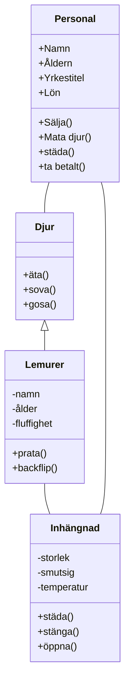

# Design

## Nouns

1. Lemurer
2. Djur (interface)
3. Inhängnad (class)
4. Butik (class)
5. Personal
6. Biljetter
7. Förtäring
8. Namn
9. Akvarium
10. Terrarium

## Verbs

1. Köpa biljett
2. Titta på djur
3. Äta
4. Ta betalt
5. Sälja
6. Mata djur
7. Städa
8. Vårda djur
9. Schemalägga personal
10. Betala ut löner

